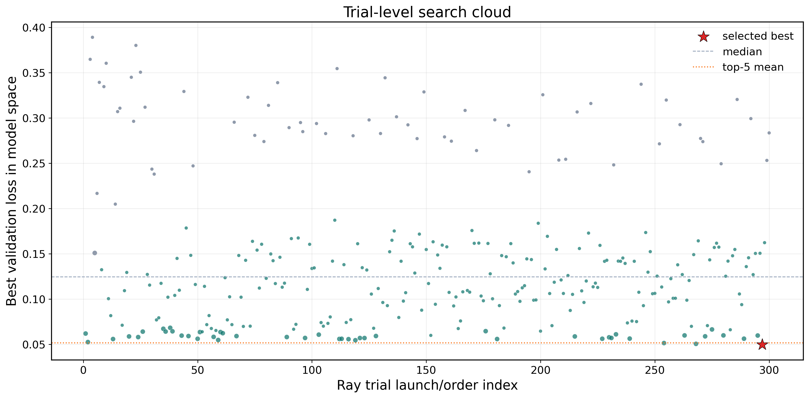
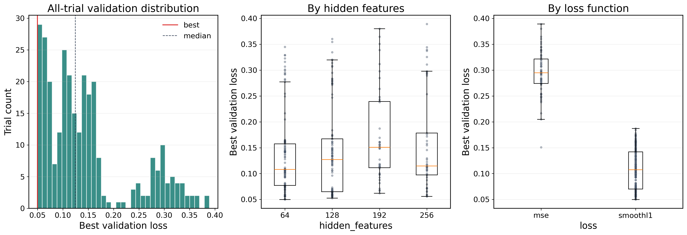
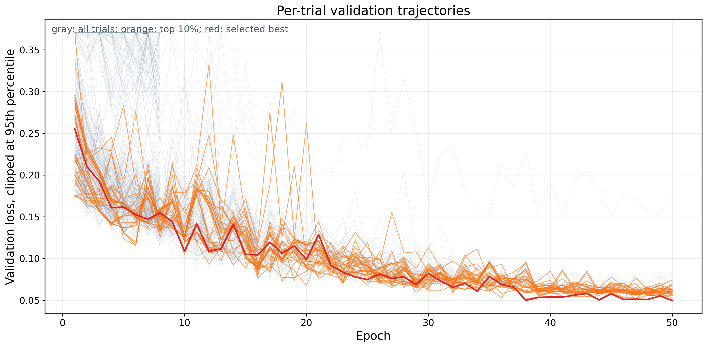
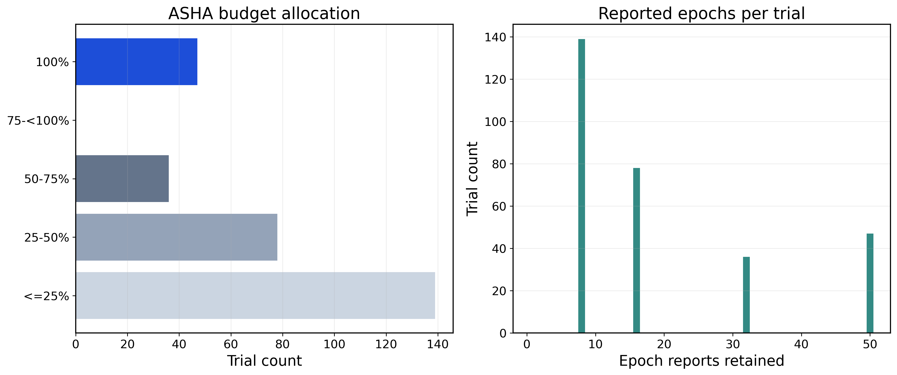
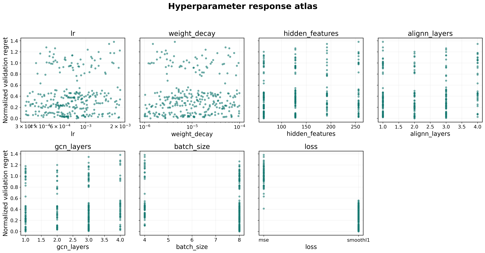
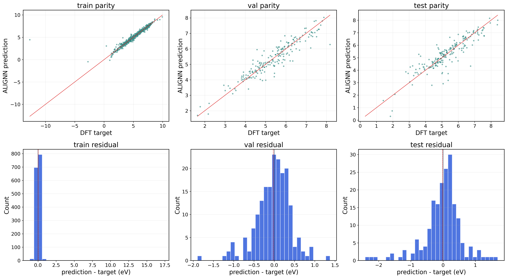
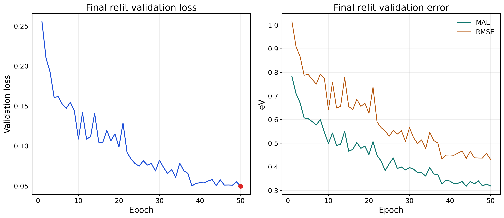

# ALIGNN Ray300 HPO Ablation Package

This folder contains the public, sanitized evidence package for the ALIGNN hyperparameter optimization (HPO) experiment on the MatHub-2D work-function prediction task. It was prepared to document that the ALIGNN baseline was tuned systematically rather than by a small manual search.

## Purpose

The experiment addresses reviewer concerns about whether the ALIGNN baseline was sufficiently tuned and whether its final hyperparameters were reported. The package records the full 300-trial Ray Tune HPO trajectory, the validation-selected best configuration, final refit/test metrics, diagnostic figures, and scripts used to launch, aggregate, and summarize the experiment.

## Task and Target

The target is the work function in eV:

```text
workfunction_eV = evac_eV - efermi_eV
```

The fixed split used for this package is:

```text
train / validation / test = 1519 / 189 / 191
```

The test split was not evaluated during HPO. Hyperparameter selection was based only on validation loss, and test metrics were reported after the validation-selected configuration was refit.

## HPO Protocol

| Item | Value |
| --- | --- |
| Model | ALIGNN scalar regression |
| HPO framework | Ray Tune |
| Search algorithm | HyperOptSearch |
| Scheduler | ASHA |
| Trials | 300 |
| Max epochs per trial | 50 |
| Grace period | 8 epochs |
| Optimized metric | validation loss in standardized model space |
| Hardware summary | 12 NVIDIA RTX 4090 GPUs, one GPU per trial |

## Search Space

| Hyperparameter | Values/range |
| --- | --- |
| `hidden_features` | `[64, 128, 192, 256]` |
| `alignn_layers` | `[1, 2, 3, 4]` |
| `gcn_layers` | `[1, 2, 3, 4]` |
| `batch_size` | `[4, 8]` |
| `loss` | `mse`, `smoothl1` |
| `lr` | log-uniform `[3e-4, 2e-3]` |
| `weight_decay` | log-uniform `[1e-6, 1e-4]` |

## Best Configuration

The validation-selected best configuration was:

```json
{
  "hidden_features": 64,
  "alignn_layers": 2,
  "gcn_layers": 1,
  "batch_size": 8,
  "loss": "smoothl1",
  "lr": 0.0008350182411692174,
  "weight_decay": 1.3314703565427604e-06
}
```

The selected trial reached its best validation loss at epoch 50.

## Final Refit/Test Metrics

After HPO, the best configuration was refit and evaluated once on the held-out test split.

| Split | N | MAE/eV | RMSE/eV | R2 |
| --- | ---: | ---: | ---: | ---: |
| Train | 1519 | 0.1673 | 0.4960 | 0.8679 |
| Validation | 189 | 0.3195 | 0.4319 | 0.8722 |
| Test | 191 | 0.4003 | 0.5858 | 0.7822 |

## Directory Structure

```text
alignn_ray300_hpo_ablation/
  README.md
  data_splits/
    wf_seed42_80_10_10_counts1519_189_191.csv
    split_manifest.json
  hpo_results/
    ray_hpo_epoch_trajectories.csv
    ray_hpo_trial_table.csv
    trial_level_summary.csv
    top20_trials_by_validation_loss.csv
    best_so_far_updates.csv
    best_config_boundary_check.csv
    ray_hpo_summary.json
    global_best_trial.json
  final_refit/
    config.json
    metrics.json
    history.csv
    train_predictions.csv
    val_predictions.csv
    test_predictions.csv
  figures/
    fig1_trial_level_search_cloud.png
    fig2_trial_performance_distribution.png
    fig3_epoch_learning_trajectories.png
    fig5_asha_budget_allocation.png
    fig6_hyperparameter_response_atlas.png
    fig10_final_refit_parity_residual.png
    fig11_final_refit_history.png
  reports/
    alignn_ray300_wf_hpo_supporting_evidence_report.md
  scripts/
    launch_alignn_ray_hpo.py
    train_alignn_workfunction.py
    aggregate_alignn_ray_hpo_runs.py
    run_ray300_80_10_10_postprocess.py
    make_alignn_ray_hpo_report.py
```

## Key Files

- `hpo_results/ray_hpo_epoch_trajectories.csv`: per-epoch validation trajectories for all retained HPO trials.
- `hpo_results/ray_hpo_trial_table.csv`: trial-level HPO table with sampled hyperparameters and validation metrics.
- `hpo_results/trial_level_summary.csv`: cleaned trial-level summary used for plotting and evidence tables.
- `hpo_results/top20_trials_by_validation_loss.csv`: top trials ranked by validation loss.
- `hpo_results/global_best_trial.json`: selected best trial and final hyperparameter configuration.
- `final_refit/metrics.json`: final refit train/validation/test metrics.
- `final_refit/*_predictions.csv`: final predictions and residuals for each split.
- `figures/`: reviewer-facing evidence figures with enlarged fonts.
- `reports/alignn_ray300_wf_hpo_supporting_evidence_report.md`: human-readable supporting report.

## Evidence Figures

### Trial-level search cloud



### Full-trial performance distribution



### Per-trial validation trajectories



### ASHA early stopping and budget allocation



### Hyperparameter response atlas



### Final refit/test diagnostics



### Final refit history



## Reproducibility Notes

The raw structure database is not included in this ablation package. The split file is included so that trial records and final prediction files can be inspected consistently. To rerun the experiment, place the structure database at the path expected by your local project and pass it explicitly to the training/HPO scripts.

Typical workflow:

```bash
# Launch Ray Tune HPO. Adjust paths for your repository layout.
python scripts/launch_alignn_ray_hpo.py \
  --db raw/structures.db \
  --split-file data_splits/wf_seed42_80_10_10_counts1519_189_191.csv \
  --target wf \
  --num-samples 300 \
  --epochs 50 \
  --output-dir ray_hpo/alignn_ray300_wf

# Aggregate HPO runs if they were launched in multiple groups.
python scripts/aggregate_alignn_ray_hpo_runs.py \
  --run group_A=ray_hpo/group_A \
  --run group_B=ray_hpo/group_B \
  --output-dir hpo_results/combined

# Refit the selected configuration and evaluate once on the test split.
python scripts/train_alignn_workfunction.py \
  --db raw/structures.db \
  --split-file data_splits/wf_seed42_80_10_10_counts1519_189_191.csv \
  --target wf \
  --epochs 50 \
  --batch-size 8 \
  --alignn-layers 2 \
  --gcn-layers 1 \
  --hidden-features 64 \
  --lr 0.0008350182411692174 \
  --weight-decay 1.3314703565427604e-06 \
  --loss smoothl1 \
  --output-dir final_refit/reproduced_best
```

## Sanitization

This package was sanitized for public repository upload. Internal paths, usernames, machine hostnames, node IPs, process IDs, and Ray local log directories were removed from the public result tables and JSON files. Run groups are labeled generically as `group_A` and `group_B` only to preserve the fact that the 300 trials were collected from multiple parallel groups.

## Files Not Included

The following are intentionally not included:

- Raw `structures.db` and separate full dataset artifacts.
- PyTorch checkpoint files such as `best_model.pt`.
- macOS metadata files.
- Rendered Word/PDF intermediates and old smoke-test outputs.

This keeps the package focused on HPO evidence, ablation trajectories, final metrics, and reproducibility code.
